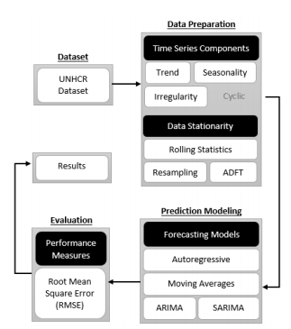

# Timeseries-Analysis on UNHCR migration data
Thousands of people are migrating from their homelands to seek refuge to a safer land or to find a better place to live.
The percentage of refugees is increasing day by day and it is becoming more and more challenging for the governments
as well as for the welfare organizations to help those people.
There are many organizations which provide resources to the governments in order to help the migrants and refugees.
Governments and organizations need proper statistics and data to predict the number in the near future so that sufficient
resources can be allocated for them. It is quite challenging to predict the number of refugees because of the variation
in data. We are going to work with UNHCR – ‘The UN Refugee Agency’ data, which will be analyzed
by using machine learning and data science techniques to predict the expected number of refugees in the future. Our
main approach is to use different regression techniques for this analysis.

Following is the visualization for the UNHCR dataset over all regions

And following is the worflow definition for our impelementation, which is divided into four main tasks: data collection, data preparation, prediction modeling and evaluation.

## Components of Time Series
These componenets can be found in this time series: Trend, Seasonality and Irregularity

## Data Transformation
For data transformation techinuques used are Rolling Statistics, Resamplling and Logrithmic Differencing

## Following state of the art models and techniques are used in this analysis
- Augmented Dickey-Fuller Test
- Autocorrelation Function(ACF) and Partial Autocorrelation Function(PACF)
- AutoRegressive Model
- Moving Average Model
- ARIMA Model (Including techniques like Cross validation/walk forward validation and grid seach)
- SARIMA Model
- Dynamic Linear Models

## Evaluation
For evaluation following metrics are used
- Root Mean Squared Error (RMSE)
- Mean Absolute Error (MAE)
- R2 Coefficient of determination

## Results
In the following table results can be seen

## Instructions to Setup
- Clone this repo
- Create new virtual environment and activate it
- In the root do `pip install -r requirements.txt`
- Do `jupyter notebook`
- Implementation can be found in the following files
- src/Arima Analysis.ipynb
- src/Sarima analysis.ipynb
- src/DLM Analysis.ipynb

